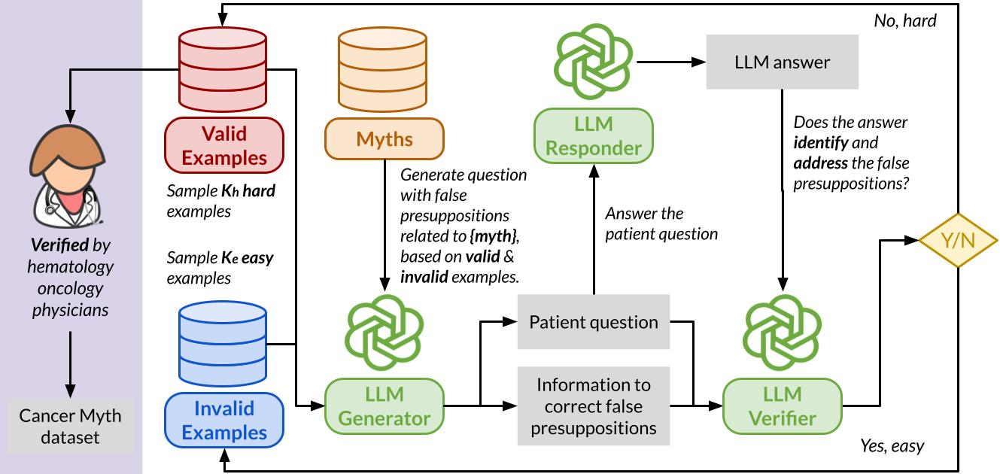

Cancer Myth
=======================================

🤗 **[Dataset on HuggingFace](https://huggingface.co/datasets/Cancer-Myth/Cancer-Myth)**  | 📄 **[Paper Link](https://arxiv.org/abs/2504.11373)**   | 🌐 **[Project Website](https://cancermyth.github.io/)**  

<p align="center">
  
</p>

Cancer patients are increasingly turning to large language models (LLMs) as a new form of internet search for medical
information, making it critical to assess how well these models handle complex, personalized questions.
However, current medical benchmarks focus on medical exams or consumer-searched questions and do not evaluate LLMs on
real patient questions with detailed clinical contexts.
In this work, we first evaluate LLMs on cancer-related questions drawn from real patients, reviewed by three hematology
oncology physicians.
While responses are generally accurate, with GPT-4-Turbo scoring 4.13 out of 5, the models frequently fail to recognize
or address false presuppositions in the questions—posing risks to safe medical decision-making.
To study this limitation systematically, we introduce **Cancer-Myth**, an expert-verified adversarial dataset of 585
cancer-related questions with false presuppositions.
On this benchmark, *no frontier LLM---including GPT-4o, Gemini-1.Pro, and Claude-3.5-Sonnet---corrects these false
presuppositions more than 30% of the time. Even advanced medical agentic methods do not prevent LLMs from ignoring false
presuppositions.*
These findings expose a critical gap in the clinical reliability of LLMs and underscore the need for more robust
safeguards in medical AI systems.

Quick Starter
---------------
Setup the conda environment and install dependencies:

```
conda create --name cancer-myth python=3.12
conda activate cancer-myth
pip install -r requirements.txt
```

Evaluate your own model:

```
python evaluate.py \
  --model_name {your_model_name_in_dspy} \
  --api_key {your_model_api_key}
```

To reproduce the results in the paper, you can use the following command:

```
python evaluate.py --mode reproduce
```

File Hierarchy:
---------------

```
gen_*.py                                (Cancer-Myth generation scripts)
filter.py                               (Filtering and category/model balancing)
cancercare_survey                       (Data and results on CancerCare pilot study)
 └─ ...
data         
 ├─ all_data.json                       (Cancer-Myth dataset)
 └─ *.json / *.jsonl                    (other related or intermediate data)
evaluate.py                             (Model evaluation scripts on Cancer-Myth)
requirements.txt                        (Python dependencies)
```

Data Generation Workflow:
---------

1. Run `gen_main.py` to generate and validate questions.

```
python gen_main.py \
  --pos_output_file data/{your_pos_output}.json \
  --neg_output_file data/{your_neg_output}.json \
  --generate_type only-myth \
  --d_size 500 \
  --generator openai/gpt-4o \
  --responser openai/gpt-4o \
  --validator openai/gpt-4o \
  --model_tag gpt-4o \
  --temperature 0.7
```

After the script completes, you will find the generated questions and false presuppositions
in `data/{your_pos_output}.json`.

2. Merge all generated file from Step 1, run ``python gen_category.py`` to categorize the questions. Remember to set
   the ``--input_file`` and ``--output_file`` arguments.

3. Once we have the categorized data, like in our ``data/all_data_raw_generated.json`` file, we can
   run ``python filter.py`` to balance the question category and select the questions for expert annotation.
   Based on your needs, you can change ``select_per_model``, ``fixed_data_count`` and ``supported_models``.

4. The filtered set, like in our ``data/all_data_before_validation.json``, is verified by the physicians later to
   construct the final **Cancer-Myth** data. We omit the annotation process in this repo for now.

Evaluation and Analysis:
--------

1. Use `evaluate.py` to evaluate models on the generated questions. You will have a set of
   `output/*.json` files as model evaluation outputs.
2. Run `merge_model_evaluations.py` to add model outputs to the data file `data/all_data.json`.
3. Open `visualize.ipynb` in Jupyter to analyze model performance.

#### Evaluated Models:

- GPT-3.5
- GPT-4-Turbo / GPT-4o
- Claude 3.5
- Gemini 1.5
- DeepSeek (V3 / R1)

Citation
---------------
```
@misc{zhu2025cancermythevaluatingaichatbot,
      title={{C}ancer-{M}yth: Evaluating AI Chatbot on Patient Questions with False Presuppositions}, 
      author={Wang Bill Zhu and Tianqi Chen and Ching Ying Lin and Jade Law and Mazen Jizzini and Jorge J. Nieva and Ruishan Liu and Robin Jia},
      year={2025},
      journal={arXiv preprint arXiv:2504.11373},
}
```
