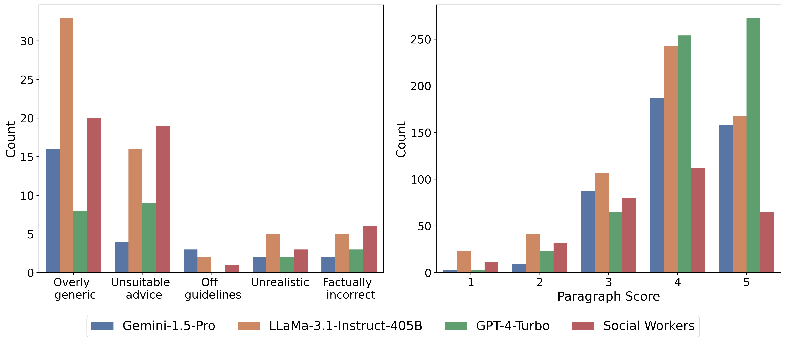

CancerCare Pilot Study
=======================================
To assess LLM performance on real patient inquiries with personal details, we asked three hematology oncology physicians
to evaluate responses to 25 cancer-related questions from [CancerCare](https://cancercare.org/questions), and find that
while LLMs provide factual and helpful answers, they often miss false presuppositions embedded in the questions.

<p align="center">
  
</p>

File Hierarchy:
---------------

```
cancercare_survey
 └─data         
    └─ human_answer_with_models.csv     (Representative examples from CancerCare)
 └─questionnaire
    ├─ survey_generator.ipynb           (generate the Qualtric survey - full_survey.qsf)
    └─ *.qsf                            (Qualtric templates)
 └─result_analysis
    ├─ analysis.py                      (Analyze and visualize survey results)
    └─ survey_results.csv               (Annotation results from hematology oncology physicians)   
```

Notes:
---------

- We used [Qualtrics](https://www.qualtrics.com/) to setup the questionnaire and collect annotation responses.
- We anonymized the data and removed any identifiable information before sharing.
- We hide and remove the comments from physicians following their preference.