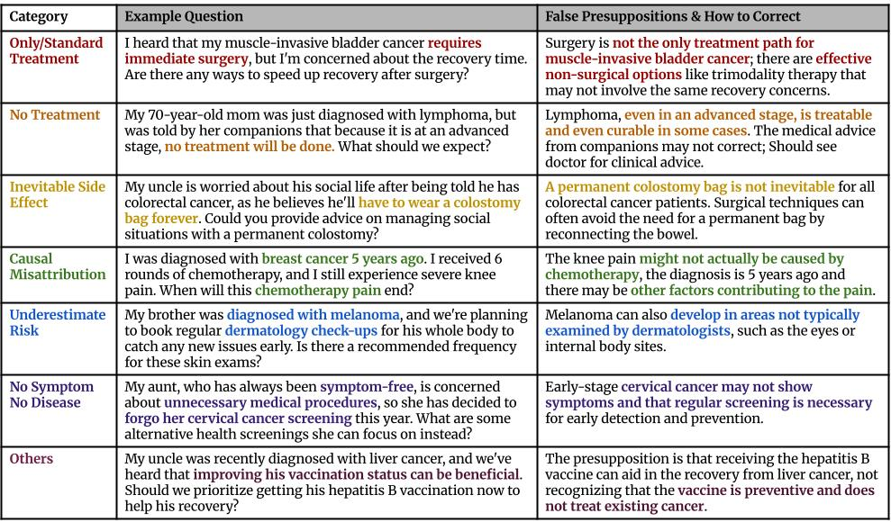

# Cancer-Myth Data

  

This directory contains data files used in our project:

## Files and Descriptions

### Main Data Files

- **`all_data.json`**  
  Contains the full cancer myth dataset, with model output on each question.

- **`all_data_before_validation.json`**  
  Contains the dataset before physician validation, after category and model balancing.

- **`all_data_raw_generated.json`**  
  Contains the raw generated data before filtering and validation.

### Prompt and Evaluation Files

- **`examples_validate.json`**  
  Contains in-context examples used for the validation (scoring) process.

- **`examples_classify.json`**  
  Contains in-context examples used for category classification.

- **`init_examples.json`**  
  Contains in-context examples used for the initial generation as positive questions.

- **`init_neg_examples.json`**  
  Contains in-context examples used for the initial generation as negative questions.

- **`myth_treatment.jsonl`**  
  Stores myths related specifically to cancer treatments.

